# Group Project: Design Journey

**For each milestone, complete only the sections that are labeled with that milestone.** Refine all sections before the final submission.

You are graded on your design process. If you later need to update your plan, **do not delete the original plan, leave it in place and append your new plan _below_ the original.** Then explain why you are changing your plan. Any time you update your plan, you're documenting your design process!

**Replace ALL _TODOs_ with your work.** (There should be no TODOs in the final submission.)

Be clear and concise in your writing. Bullets points are encouraged.

**Everything, including images, must be visible in _Markdown: Open Preview_.** If it's not visible in the Markdown preview, then we can't grade it. We also can't give you partial credit either. **Please make sure your design journey should is easy to read for the grader;** in Markdown preview the question _and_ answer should have a blank line between them.


## Client (Milestone 1)

### Client Description (Milestone 1)
> Tell us about your client. Who is your client?
> Explain why your client meets the client rules in the project requirements.

Our client is Bool Street Noods. They are a student run noodle company that runs
in Collegetown.

This client meets the client rules as they are a small business that currently operate with a wix website that is not really used by the company as they mostly function through social media platforms. They have informed us that they would like a website that relaysinformation to students  and customers and also understand the limitations of this project in terms of including non-static elements. Furthermore, none of the team members are part of this organization as we do not work for or with bool street noods.


### Client Questionnaire (Milestone 1)
> Develop a client questionnaire to learn more about your client and their goals.
> You may use the questionnaire below, you may modify the questionnaire below, or you may create your own.

1. Describe your organization and its purpose.

    We are a noodle company based in collegetown and are open one day a week. We make hot oil-seared biang biang noodles that are sold at affordable prices to students at Cornell. Our goal is to provide cheap and tasty food to all college students.

2. What makes your organization and its services special or unique?

    All our profits go to a different social cause every week. We have donated over 2000 dollars so far to Operation Hope, the Breast Cancer Research Foundation and more. Additionally, as we are student run we hope to form and leverage a close knit community on the Cornell campus.


3. Why are you looking for a new website or updating your existing site?

    We currently operate solely through social media platforms like instagram as
    our website is hosted on wix and is not really usable or updated. We would like
    to build a website so that it reflects our updated information for students to
    access to find out about our company.


4. Who do you want to visit your site? Who do you believe is your website's intended audience?

    I think the intended audience of our website is the students who buy our noodles
    every week. They are the ones that keep our business running so I would assume
    it is for them!


5. When visiting your site, what actions do you want your visitors to take?

    I want them to get information about when we are open during the week, when
    they can put orders in, where they should come to pick up their food and
    finally, where our profits are going for the week.

6. What are your goals for this site?

    I think my goal for the website is to make it a tool to propagate bool
    street noods’ mission and also make the information about orders more
    accessible to all our customers.


7. Is there a "feel" that you want for your site? Are there colors or imagery that you have in mind?

    Since our company colors are red, yellow and white, I would like the website to
    reflect this. However, we want to stay with a clean feel by keeping the overall
    site modern with media and some inclusion of the company colors.


8. What are your three favorite competitors or similar organizations' websites? Why?

    1. [Four Seasons Ithaca](https://www.ithacatogo.com/r/1417/restaurants/delivery/Korean/Four-Seasons-Ithaca)
    2. [Oishii Bowl](https://www.oishiibowl.com/)
    3. [Gangnam Station Ithaca](https://www.gangnamstationithacany.com/)


### First Client Meeting Minutes/Notes (Milestone 1)
> Include your notes/minutes from your first meeting with your client.

- Meeting minutes.
- Introductions of the team members and official approval of the project
- Approval of limitations as well as timeline.
- Discussion of client questionnaire as noted above.
- Outlining future meetings to call the client once a week and email mockups of the website.


### Client Website (Milestone 1)
> Tell us about the website that your client wants.
> Tell us the purpose of the website and what it is all about.
> Note: **If you are redesigning an existing website, give us the current URL and some screenshots of the current site.** (FireFox makes it easy to take a full screenshot of a page from the context menu (right click).)
> If you are redesigning an existing site, tell us how you plan to update the site in a significant way that meets the project's requirements.

[Current Client Bool Street Noods Website](https://boolstreetnoods.wixsite.com/website)

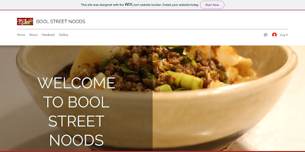
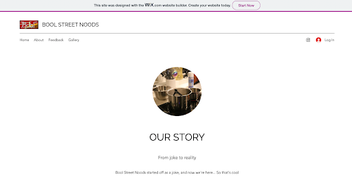
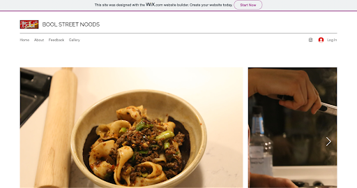


The client wants a company informational website where students and customers can go
to find necessary information about the website. This would entail information about
the food the client serves, the days and hours of operation, background about the
founders and the team, and information about the organizations they donate their
profits to along with other special events.


### Client Goals (Milestone 1)
> Identify your client's goals for the website.
> What kind of website do they want? What are their goals for the site?
> There is no required number of goals. You need as many goals as necessary to reflect your client's desires.

- Goal 1: To introduce customers to the company
- Goal 2: To provide customers with information about the dishes they serve
- Goal 3: To provide a background profile about the founders of the company
- Goal 4: To inform students about hours of operation and the pickup location of the orders
- Goal 5: To show customers all the organizations that the proceeds would be going to week by week
- Goal 6: To inform people about Special events and partnerships


### Client Website Scope (Milestone 1)
> We want your project to be successful! It needs to be ambitious, but not too large.
> A good rule-of-thumb is that you should have about 1 content-full page for each team member.
> Explain why the website you will create for your client isn't too small and isn't too big.
> Explain why you think it's the right size for this project.

Our proposed website is the right “size” for this project as the client is a small business that currently is only operating through social media platforms and thus is not a business or organization that will contain a multitude of information that will make the website beyond the scope of this project. On the flip side, our proposed website is not too small either as there is just enough information for several pages of content to be created for the small business and have a lot of content they still wish to convey to users/customers as they are beginning to establish their online presence.


## Plan/Schedule (Milestone 1)
> Make a plan of when you will complete all parts of this assignment.
> This plan is for your team. There is no required format. Format it so that it works for you!
> Your plan should include when you will interview users and analyze their goals.
> Your plan should also include how and when you will assemble/create the sit's content.
> **Tip:** Your team should plan to work ahead. This project really isn't feasible to complete the night before a deadline.

- User Research: 10/30
  - Assign roles
- Example Sites: 10/30
- Designing website: 10/30
  - Group meeting/zoom/etc
  - Cardsorting
  - Navigation
  - Visual Design
  - Interactivity planning
  - Sketches of wide and narrow
- Client Meeting 2: 10/31/22
  - Feedback on final sketches
- Draft Website HTML: 11/8/22
  - HTML finished and content gathered
  - Some responsivity
  - Some interactivity
- Milestone 2: 11/16
- Finish Draft Website: 11/21
  - Responsivity functional
  - Interactivity functional
- User Tests: 11/23/22
  - 5 people
  - Assign roles
- Revisions: 11/25/22
- Review: 11/26/22
- Client Meeting 3: 11/27/22
- Final Submission: 11/30


## Understanding Users (Milestone 2)

**Make the case for your decisions using concepts from class, as well as other design principles, theories, examples, and cases from outside of class.**

You can use bullet points and lists, or full paragraphs, or a combo, whichever is appropriate. The writing should be solid draft quality, but it doesn't have to be fancy.


### User Interview Questions (Milestone 2)
> Plan the user interview which you'll use to identify the goals of your site's audience.
> You may use the interview template below and revise it as much as you desire.

**User Interview Briefing & Consent:** "Hi, I am a student at Cornell University. I'm currently taking a class on web design and for a project, I am designing the website for Bool Street Noods. I'm trying to learn more about the people that might use this site. May I ask you a few questions? It will take about 10 minutes. You are free to quit at any time."

1. Please tell me a bit about yourself. You may omit any personal or private information.

2. How often do you eat out?

3. Refer back to the last time you went to a restaurant. Did you use the restaurant website and if so what was your experience with it?

4. What was the first type of food (appetizers, entree, dessert, etc.) did you order the last time you went to a restaurant?

5. Think back on your previous experiences with restaurant websites. How often do you refer to the store hours on the website?

6. When you go on restaurant websites, how do the images with the corresponding dishes affect your food choices?

...

n. What haven't I asked you today that you think would be valuable for me to know?

**After the interview:** "This was really helpful. Thank you so much for agreeing to speak with me today. Have a great day!"


### Interview Notes (Milestone 2)
> Interview at least 1 person for every member of your team from your audience.
> Take notes and include those notes here. Make sure to include a brief description of each interviewee.
> **Copy the interview questions above into each interviewee section below.**
> Take notes for each participant inline with the questions.

**Interviewee 1:**

Tell us a bit about your participant:

My participant is Andres Aradillaz-Fernandes. He is a student at Cornell University, double majoring in Mathematics and Economics.

1. Please tell me a bit about yourself. You may omit any personal or private information.

    Sophomore, double majoring in Mathematics and Economics. Plays jazz piano.

2. How often do you eat out?

    Probably 5 times a week.

3. Refer back to the last time you went to a restaurant. Did you use the restaurant website and if so what was your experience with it?

    Did not use the restaurant website.

4. What was the first type of food (appetizers, entree, dessert, etc.) you ordered the last time you went to a restaurant?

    An entree

5. Think back on your previous experiences with restaurant websites. How often do you refer to the store hours on the website?

    Never because doesn't trust that the restaurants have their websites up-to-down.

6. When you go on restaurant websites, how do the images with the corresponding dishes affect your food choices?

   It depends. For him a website of the restaurant either has great pictures and that affects a lot him eating there, or they have no pictures but he ecognizes the color and that makes no difference.

7. What haven't I asked you today that you think would be valuable for me to know?

   N/A


**Interviewee 2:**

Tell us a bit about your participant:

My participant is Alsa Khan. She is a student at Cornell University majoring in Human Development.

1. Please tell me a bit about yourself. You may omit any personal or private information.

    Sophomore majoring in Human Development and planning to transfer into Information Science.

2. How often do you eat out?

    They eat out around 3 times a week.

3. Refer back to the last time you went to a restaurant. Did you use the restaurant website and if so what was your experience with it?

    The last time they went to a restaurant, they did not use the restaurant website as they were already familiar with the restaurant.

4. What was the first type of food (appetizers, entree, dessert, etc.) did you order the last time you went to a restaurant?

    They ordered an entree first the last time they went to a restaurant.

5. Think back on your previous experiences with restaurant websites. How often do you refer to the store hours on the website?

    They refer back to the store hours on the website often as they feel unsure of if they remember the store hours exactly from their memory.

6. When you go on restaurant websites, how do the images with the corresponding dishes affect your food choices?

    They find that the images greately affect their food choices especially when they are going to a new restaurant or if a different type of cuisine than they are already very familiar with is being offered at the restaurant.

7. What haven't I asked you today that you think would be valuable for me to know?

    They do like to view restaurant websites when they are deciding whether or not to go to a restuarant or if they are gonig to a restaurant for the first time.

**Interviewee 3:**

Tell us a bit about your participant:

My participant is Roy. He is a student at Cornell University majoring math.

1. Please tell me a bit about yourself. You may omit any personal or private information.

    Roy majors in math. He is a junior. He's from China.

2. How often do you eat out?

    Once a week.

3. Refer back to the last time you ordered out. Did you use the restaurant website and if so what was your experience with it?

    He stayed over the majority of the winter and used UberEats.

4. What was the first type of food (appetizers, entree, dessert, etc.) did you order the last time you went to a restaurant?

    Just entree. He has simple meals.

5. Think back on your previous experiences with restaurant websites. How often do you refer to the store hours on the website?

    Pretty often. Around 60-70% of the time he uses the store hours on the website.

6. When you go on restaurant websites, how do the images with the corresponding dishes affect your food choices?

    Pretty significantly. English isn't his first language so he goes off of the images of the food when he doesn't understand the details of the menu.

7. What haven't I asked you today that you think would be valuable for me to know?

    He doesn't use restaurant websites that often. He usually orders over apps such as UberEats and GrubHub.

**Interviewee 4:**

Tell us a bit about your participant:

My participant is a sophomore student at Cornell University majoring in physics and computer science.

1. Please tell me a bit about yourself. You may omit any personal or private information.

    He is a sophomore student, majoring in physics and computer science. They are from California in the bay area.

2. How often do you eat out?

    The participant eats out once week.

3. Refer back to the last time you ordered out to. Did you use the restaurant website and if so what was your experience with it?

    Yes they ordered out from the website. It was pretty smooth, I just llooked at the menu and went in person to pick it up.

4. What was the first type of food (appetizers, entree, dessert, etc.) did you order the last time you went to a restaurant?

    It was pork and egg on rice.

5. Think back on your previous experiences with restaurant websites. How often do you refer to the store hours on the website?

    Not really, I normally dont each much but when I do, I eat at normal hours.

6. When you go on restaurant websites, how do the images with the corresponding dishes affect your food choices?

    Yes it does. i feel like what I imagine a dish to be from reading the description is different from what it looks like. A picture is unambiguous and clears doubts.

7. What haven't I asked you today that you think would be valuable for me to know?

    A list of allergens included with the dishes. The last time I ordered out they didnt list allergens.


**Interviewee 5:**

Tell us a bit about your participant:

My participant is a junior student at Cornell University majoring in biology.

1. Please tell me a bit about yourself. You may omit any personal or private information.

    She is a junior at Cornell University studying biology. She is from New Jersey.

2. How often do you eat out?

    The participant eats out three times a week.

3. Refer back to the last time you ordered out to. Did you use the restaurant website and if so what was your experience with it?

    They did use the restaurant website to order their food and had a smooth experience.

4. What was the first type of food (appetizers, entree, dessert, etc.) did you order the last time you went to a restaurant?

    They only ordered an entree.

5. Think back on your previous experiences with restaurant websites. How often do you refer to the store hours on the website?

    They often refer to the store hours on the website as they say that the restaurants they go to often change their hours.

6. When you go on restaurant websites, how do the images with the corresponding dishes affect your food choices?

    They find that the images greatly determine whether or not they want to order something, or they may find something looks different than what the description says and they may either find it more or less appetizing.

7. What haven't I asked you today that you think would be valuable for me to know?

    They think they should also ask about if vegetarian or vegan options are labeled on the website and their dietary choices.


### Goals (Milestone 2)
> Analyze your audience's goals from your notes above.
> List each goal below. There is no specific number of goals required for this, but you need enough to do the job (Hint: It's more than 1 and probably more than 2).

Goal 1: To find out what dishes are being sold

- **Design Ideas and Choices** _How will you meet those goals in your design?_
  - Having a menu with an accordion. The menu items would have plus or arrow icons, and when clicked, the photo of the dish along with the allergen and price information would appear.
- **Rationale & Additional Notes** _Justify your decisions; additional notes._
  - A menu is a common practice in all the places that offer food. Hence, the user that needs to find out what food is offered at the Bool Street Noods would expect to see a menu in their website. The decision to make the menu in a form of accordion is done so that it is easier to browse the menu, the menu looks more concise and easy to use, not much scrolling is needed, and the user can see only the information and the photos that they ar interested in (by clicking the icon next to the meal name).

Goal 2: To find out the timings and location

- **Design Ideas and Choices** _How will you meet those goals in your design?_
  - Have a separate page for the pick-up information
- **Rationale & Additional Notes** _Justify your decisions; additional notes._
  - We think that the timing and location are very important for the users in their ordering process, hence that information has to be very easy to detect and see. To have the pick-up information with ultimtely the open hours and the pick-up location is the best solution. The user who has browsed the menu and/or already knows what they want to order would see the pick-up location right at the navigation bar and do not have to worry about finding this critical information in the large amount of paragraphs.

Goal 3: To find out allergens in the dishes

- **Design Ideas and Choices** _How will you meet those goals in your design?_
  - The design idea is to have a paragraph of text or a list that includes and explains all the allergens that the specific food contains in the menu.
- **Rationale & Additional Notes** _Justify your decisions; additional notes._
  - All the allergens are planned to be located in the menu because the user will want to see if the food contains allergens or not right when they are browsing the menu and are about to make an order. It is convinient to have that information in the menu as that way the user will not have decide on a dish, then browse the whole website to see if that dish contains any allergens. In that case, if that dish ends up contaning allergens the user will have to go back to the menu and choose another dish. This process would be long and tidious, hence we decided that it's the best to have this information right in the menu in a form of a paragraph or a list (depending how much information we get from the provider).

Goal 4: To get contact information and payment information

- **Design Ideas and Choices** _How will you meet those goals in your design?_
  - We will have a separate page for contact information.
- **Rationale & Additional Notes** _Justify your decisions; additional notes._
  - Having contact information as a separate page is a common practice that the users can expect to find in any website, including ours. We are planning to provide the phone information, social media information, and any other payment information that the users might need to place an order. This is its own grouping that would make sense for the user to see together in a separate page in a navigation bar.

### Audience (Milestone 2)
> Briefly explain your site's audience.
> Be specific and justify why this audience is a **cohesive** group with regard to your website.

The site's audience is Cornell students. This audience is cohesive because Bool Street Noods advertises themselves as an affordable food option for Cornell students.

## Website Design Exploration (Milestone 2)

Identify three websites (preferably static websites) that exist today on the web to draw inspiration from. Please select websites that are similar to the website you wish to create.

Include two screenshots of the home page for each site: narrow and wide.

**We'll refer to these are your "example websites."**

1. <[website url](https://www.oishiibowl.com/)>

    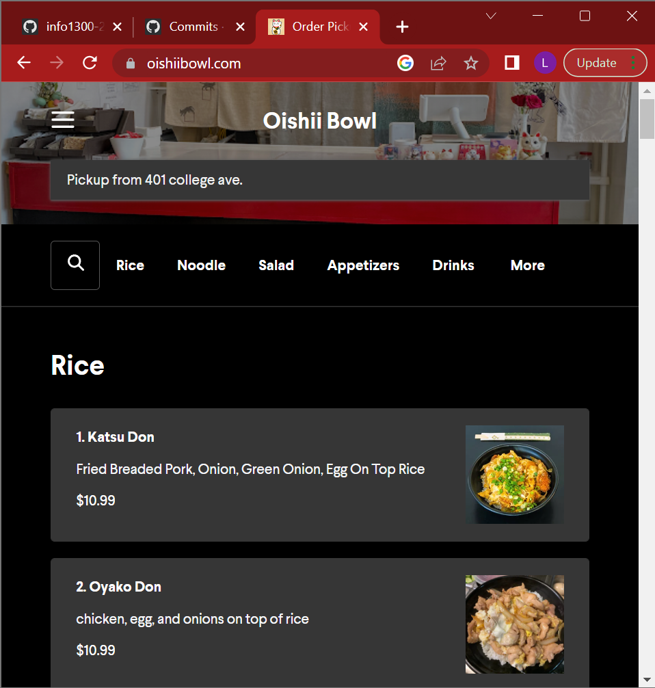

    

2. <[website url](https://www.maru-ramen.com/)>

    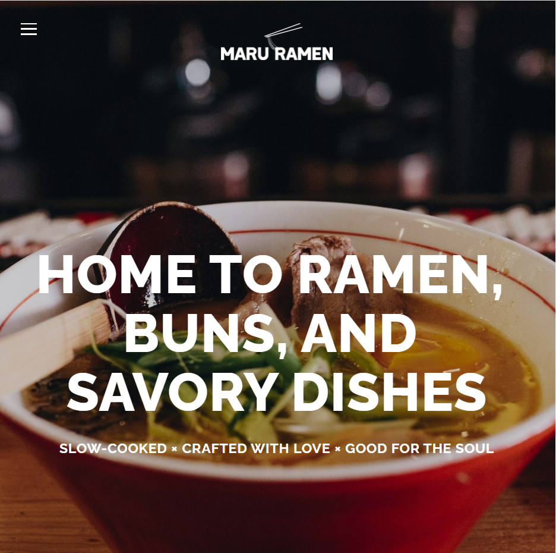

    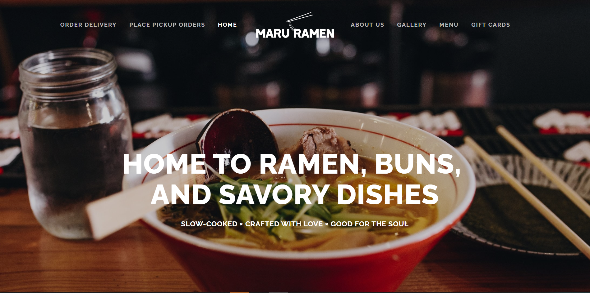

3. <[website url](https://www.gangnamstationithacany.com/)>

    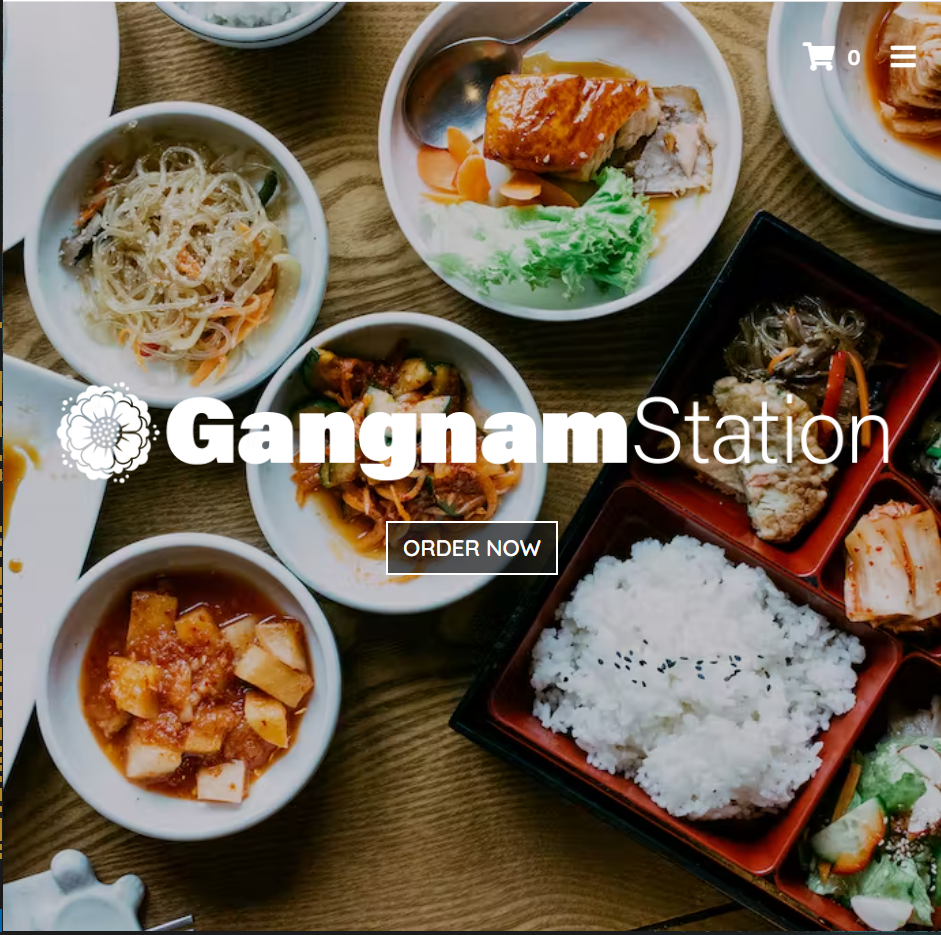

    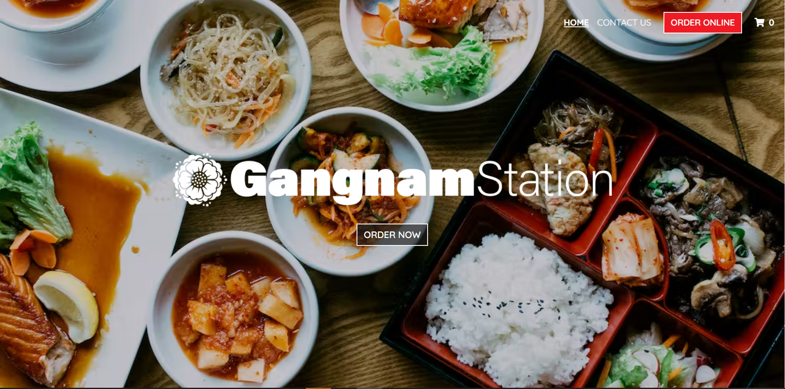


### Example Website 1 Review (Milestone 2)
> Review the website you identified above. (1 paragraph)
> In your review, include a discussion common design patterns and interactivity in the site.

In both the narrow and the wide formatting of the Oishii restaurant website, the food options are divided by rice dishes, noodle dishes, salads, appetizers, drinks, desserts, and sauces. In each section, they have the different entries, which include the name of the dish, the ingredients in each respective dish, the price of it, and an image of each of the dishes next to the information. Although each type of offering has their own dedicated section, they are all still contained on one page; clicking the different navigation elements just brings you to a different part of the page.


### Example Website 2 Review (Milestone 2)
> Review the website you identified above. (1 paragraph)
> In your review, include a discussion common design patterns and interactivity in the site.


The main difference between the wide screen and the narrow screen is the navigation bar. In the wide screen, the navigation bar is on the top, with "Order Deivery", "Pickup Order", and "Home" pages being on the left side of the website name "Maru Ramen", and "About Us", "Gallery", "Menu Items", and "Gift Cards" being on the right of the website name. When the screen size changes from wide screen to a narrow screen the navigation bar ecomes a hamburger menu. And when clicked, the hamburger menu opens the navigation bar vertically, taking the whole screen size. Other than the navigation bar, the background image sizes also adjust to be responsibe.


### Example Website 3 Review (Milestone 2)
> Review the website you identified above. (1 paragraph)
> In your review, include a discussion common design patterns and interactivity in the site.

The wide and narrow screens for the GangnamStation do not differ much/ The only slight difference is the navigation bar. The navigation bar for the wide screen is on the right top corner of the screen. For the narrow version of the website, the navigation bar becomes a hamburger menu.


## Content Planning (Milestone 2)

Plan your site's content.

### Your Site's Planned Content (Milestone 2)
> List **all** the content you plan to include your website.
> You should list all types of content you planned to include (i.e. text, photos, images, etc.)

- Background information
- Contact information
- Dish names
- Food prices
- Allergy information for food
- Images of each dish
- Ordering information

### Content Justification (Milestone 2)
> Explain (about a paragraph) why this content is the right content for your site's audience and how the content addresses their goals.

Basic information: The address and operating hours for people to know when they can order and where to pick up their orders.

Dish names: Dish names are going to be in the menu so when the user looks at the menu they know what are the available options to order.

Food prices: Users usually check the menu prices before they order from the restaurant. Including prices ensures that when the user looks for them they can find them.

Allergy information for the food: This piece of content is for people with allergies to ensure that they know what's in the food and to avoid potential health issues.

Images of each dish: This is important because if the user doesn't recognize the name of the dish they will be looking for the images to understand whether or not they want to order the food. International students especailly look at the food pictures.

Ordering/contact information: Ordering and contact information is especially necessary because this restaurant does not have a dine in option and everyone who wants to aet their food has to order it to pick up which means that the ordering and contact information has to be very visible to the user and easily accessible.

## Information Architecture (Milestone 2)

### Content Organization (Milestone 2)
> Document your **iterations** of card sorting here. You must have at least 2 iterations of card sorting.
> Include photographic evidence of each iteration of card sorting **and** description of your thought process for each iteration.
> Please physically sort cards; please don't try and do this digitally.

**Card Sorting Iteration 1**
 
In this iteration of card sorting there will be three pages on the website. The first page will contain an introduction, contact information, information about ordering and finally some pictures regarding the company and the food. The second page will contain background information along with a team picture, information about the charities being donated to and pictures of the charity logos. Finally, the third group will contain dish names and pictures, prices and allergy information. This website is concise but each page will be more content heavy. Additionally, the groups of content may not be intuitive to navigate.

**Card Sorting Iteration 2**
 
 Iteration 2 of card sorting has 5 groups of content. The first page will have an introduction to the company, bool street noods along with some pictures regarding the company and their mission. The second page will contain information about the bool street team along with background information and a team picture including behind the scenes content. The third page will contain dish names and pictures, prices and allergy information. The fourth page will have pickup information including specific pickup instructions and a guide of ordering including contact and venmo information. Finally, the fifth page will have information about the charities that bool street donates to and will be donating to. This website content is allocated so that a potential customer will be able to easily navigate through it and find the information they need.


### Final Content Organization (Milestone 2)
> Which iteration of card sorting will you use for your website?

I plan to use the second iteration of card sorting for the website.

> Explain how the final organization of content is appropriate for your site's audiences.

According to user interview and research of common design patterns that align with audience goals, the design of the website is split up logically based on what a user may be trying to locate on the website.


### Navigation (Milestone 2)
> Please list the pages you will include in your website's navigation.

- Home
- About
- Menu
- Pick-up
- Charities

> Explain why the names of these pages make sense for your site's audience.


Home page is a common practice in web design. The user familiar to the user, hence it makes sense to have the first page with the common information to be named "home".
About page is also intuitive and self-explanatory for the user to excpect what they will be seeing on it, as the "About" page always contains information about the company's history and funders/staff.
Menu page and name make sense because people usually refer to the restaurant's website to find their offerings and prices, and the menu is what is associated with those. People know that they will find all the food offerings and their prices when they click on the "menu" in the navigation bar.
Pick-up page will contain the information about ordering the food and the pick-up information. The users who enter the website with the purpose of ordering a pick-up food would immediately recognize which page to choose fro the navigation bar.
The "Charities" page contains information about the charities that this restaurant donates to. The user, when they see the "charities" page on the navigation bar, would know from the name that the page is about the charities that the restaurant donates to. The fact that the website has a separate page for the charities would mean that they give a huge important to that, and seeing that, users, in this case, university students, might be more interested in ordering from.


## Visual Theme (Milestone 2)
> Discuss several (more than two) ideas about styling your site's theme. Explain why the theme ideas are appropriate for your target audiences. Note the theme you selected for your site and why it's appropriate for the audience and their goals.


Theme Idea 1: Minimalistic Design
In this idea for the website theme, we would be utilizing black, white, and red colors for the website since those are some of the colors used in the Bool Street Noods logo. At the same time, this combination of colors wouldn't be too overbearing and would help with the minimalistic look. In addition to the color scheme, the font would be a simple soft and rounded font that doesn't look too bold. Overall this theme is appropriate for the audience because it helps to draw attention to the content that really matters such as the dishes and their prices rather than the aesthetic of the website.

Theme Idea 2: Fast food/ street food
In this idea for the website theme, we would be using the most attracting colors of the fast food industry: yellow, orange, and red. Science suggests that these colors are associatd with food among customers and seeing it the users of the website would automatically associate it with food. Other than that, it would give the currect impression of the restaurant and its mission, which is to be able to provide cheap and accessible food to college students. What else could tell better "cheap and accessible" food other than the street food and everything associated with it.

Theme Idea 3: Colorful
This idea for the website theme still using the theme colors of white, black, and red but focusing more on the red theme color than the more minimalistic route of focusing on using white and black. This would still have the vibrancy of being a fast food restaurant without having the colors be too strong and bold for the mood of the company. The audience would still get more of the energetic feelings from Bool Street Noods without feeling like it is a generic looking street food website.

The final theme selected for the website is Theme Idea 1. This is because it is a layout more familiar to the audience and is not too overbearing for the wide variety of users that would be going to the Bool Street Noods website in order to decide if they want to try food from there. In addition, it sticks more to the branding of Bool Street Noods that the owners intended their business to have.

## Design (Milestone 2)

Document your site's layout.

## Interactivity Brainstorm (Milestone 2)
> Using the audience goals you identified, brainstorm possible options for interactivity to enhance the functionality of the site while also assisting the audience with their goals.
> Briefly explain idea each idea and provide a brief rationale for how the interactivity enhances the site's functionality for the audience.
> Note: You may find it easier to sketch for brainstorming. That's fine too. Do whatever you need to do to explore your ideas.

- Interactivity idea 1: hamburger menu: this would make the navigation easier on the narrow screens. It is a common practice on the websites that use responsive design for narrow screens and is familiar to the user. This would also save some space on the narrow screen as it shows the contents in a more compact way.
- Interactivity idea 2: photo carousel: this would show the photos of food and would allow the user to explore the offered menu.
- Interactivity idea 3: drop-down items: making it possible to see the entire menu, with the possiblity of pressing on any specific item to view the recipe and image of it.


### Layout Exploration (Milestone 2)
> Iterate on your site's design through sketching.
> Sketch both the narrow and wide versions of the site.
> Here you are just exploring your layout ideas. You don't need to sketch every page.
> Include some of your interactivity ideas in your sketches.
> Provide an explanation for each sketch explaining the idea and the design patterns you are leveraging.

Layout 1: with this first layout we want to have enough space for the logo, navigation and title. This is consistent even in the narrow screen which even though transforms the dropdown in a "hamburger", still keeps it at the top of the page right next to the logo. Moreover, this sketch aims at showing the efficiency of a carausel interactivity to engage the audience.


Layout 2: With this layout we are trying to grasp the audience attention by placing the name of the company over an attractive picture. Above that we have the navigation bar which gives easy access to the user. In the narrow screen, the navigation is also transformed in "hamburger" but in a different location compared to the previous layout.


Layout 3: In this last sketch, in the wide screen part we are trying to provide the user with the most essential information regarding our website without the need to even scroll as the text and carousel are one next to the other. The narrow screen also aims at keeping all information as compact as possible by making the navigation innto an "hamburger" and hiding the carousel.


### Final Design (Milestone 2)
> Include the final sketches for each of your pages.
> **Include your final interactivity in your sketches.** Include annotations to explain what happens when the user takes an action with your interactivity.
> The sketches must include enough detail that another 1300 student could implement them.
> However, you don't need to provide layout/CSS annotations.
> Please, provide an explanation for each sketch.

**Narrow (Mobile) Design:**

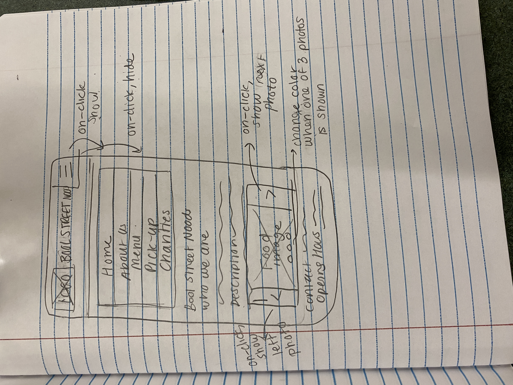
The home page for the narrow screen uses a hamburger menu to make use of the limited space. The narrow screen also still employs a carousel that will stretch to accomodate the width of the smaller screen.

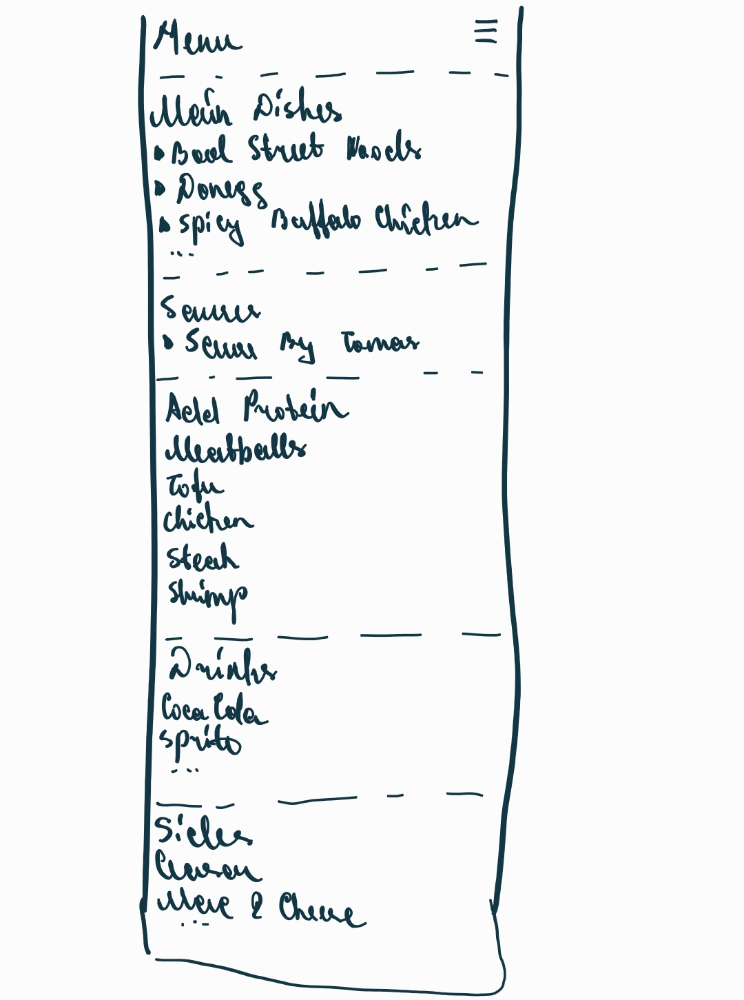
The menu page for the narrow screen uses a hamburger menu. For the better use of the limited space, the contents of the menu are one on top of the other, as opposed to the contents of the menu in a wide screen that are next to each other.

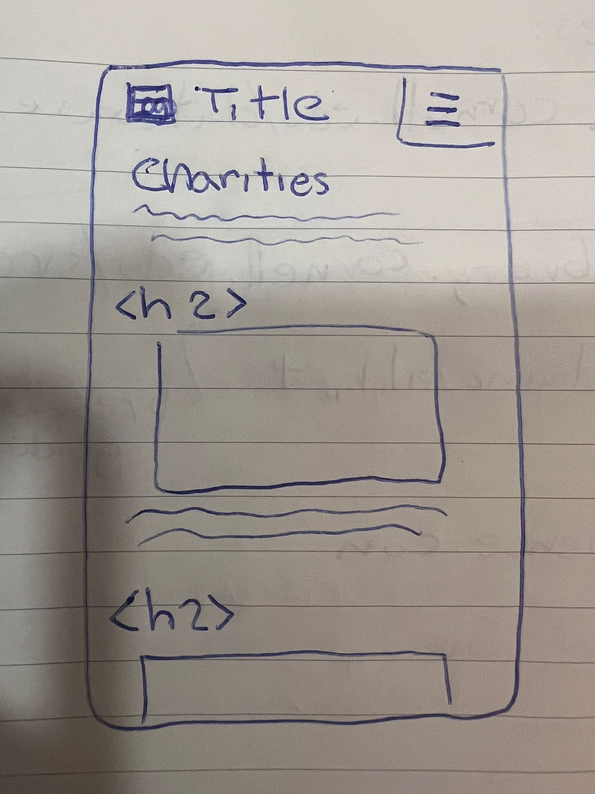
The charity page for the narrow screen uses a hamburger menu. For the better use of the limited space, the contents of the menu are one on top of the other as well as the menu page, however displayed differently. Having the image of the charity be the left big as to show its importance.


**Wide (Wide) Design:**

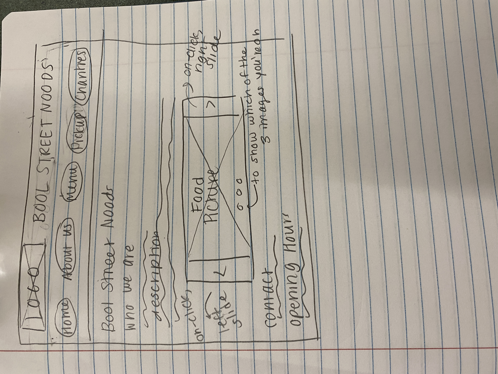
The homem page has the navigation bar as a horizontal bar to make use of the larger amount of space. The carousel on the home page is also made larger to make use of the extra space to further pop out to the audience.

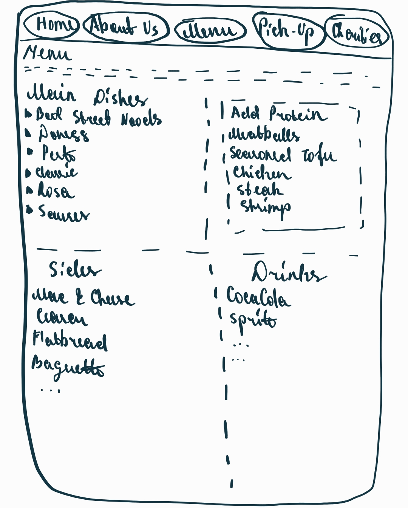
In the wide screen of the menu page the navigation is a horizontal bar instead of a hamburger menu that is implemented for the narrow screen. Because there is so much space on the screen the different sections of menu that are related to one another are put next to each other.

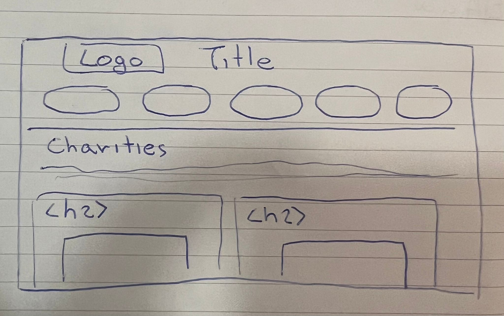
In the wide screen of the menu page the navigation is a horizontal bar instead of a hamburger menu that is implemented for the narrow screen. Moreover, the reactive design makes it now possible to show two charities in a row to use the spaces better.


### Design Rationale (Milestone 2)
> Explain why your design is appropriate for your audience.
> Specifically, why does your content organization, navigation, and site design/layout meet the goals of your users?
> How did you employ **design patterns** to improve the familiarity of the site for your audience?

This design specifically matches our audience, as it firstly works on both narrow and wide devices and in our case our audience uses both. Moreover, the division of content throughout all pages makes it very straightforward to the user, having in the navigation bar all the main things that the user might be interested in. Additionally, the design includes a lot of interactive features such as carausels and drop-down in order to provide the user with the best possible user experience, as it can use images to give the user a better understanding of its products.


## Interactivity Rationale (Milestone 2)
> Describe the purpose of your proposed interactivity.
> Provide a brief rationale explaining how your proposed interactivity addresses the goals of your site's audience and enhances their user experience.

Hamburger Menu:
The purpose of the hamburger menu is to simplify the navigation of the website when in the narrow form so that it is easier to find out what dishes are being sold, find out allergens in the dishes, and get contact information and payment information through a more properly formatted menu design.

Carousel:
The purpose of the proposed interactivity of the photo carousel is to allow the users to see different food options on the menu easily when they are on the homepage of the website. This allows the users to preview the offered menu on their first glance of the website when deciding whether or not they are interested in the food being offered and it enhances the user experience as they do not need to search deeply in order to find what food is being offered.

Dropdown Menu:
The drop down menu allows easier search of the menu items as the user can choose which item they are interested in and look only at that item's description. This makes the serfing process easier and saves time for the user.

## Interactivity Plan (Milestone 2)
> Now that you've designed your interactivity for your site, you need to plan how you will implement it.
> Describe how you will implement the interactivity. This should be a complete plan that another 1300 student could use to implement the interactivity.
> You should list the HTML elements, CSS classes, events, pseudocode, and the initial state.

Hamburger Menu:
In order to implement the hamburger menu, in terms of HTML I will be adding a "dropdown" class for the entire dropdown interaction, a "dropdown-button" class for the button, and a "dropdown-pages" class for the dropdown menu options. For CSS, I will be defining each of those classes in order to style each of those pieces of content. For JavaScript, I will be adding JavaScript so that the menu hides/shows after resizing the window, selecting the pages, and pressing the menu button. In its initial state, the menu should be hidden until it is pressed on.

```
// hides/shows content after resizing window
when window is resized:
  if the window width is greater than or equal to 600:
    add class hidden to #dropdown-button
    remove class hidden from #dropdown-pages
  else:
    remove class hidden from #dropdown-button
    add class hidden to #dropdown-pages

// hides/shows content after selecting pages
if window width is greater than or equal to 600 {
  add class hidden to #dropdown-button
  remove class hidden from #dropdown-pages
} else {
  remove class hidden from #dropdown-button
  add class hidden to #dropdown-pages
}

// hides/shows content after pressing the menu button
when button is pressed {
  if #dropdown-button is hidden {
      remove class hidden from dropdown-pages
  } else {
      add class hidden to dropdown-pages
  }
});
```

Carousel:
In order to implement the carousel menu, in the HTML I will be adding a slide class for all of the slides in the carousel, and give an id to each of the slides in the carousel. In the CSS, each of the classes and ids will be used to style the content. The .hidden class will also be used to hide the slides I do not want shown immediately on the screen. In the Javascript, it will allow for the user to click the back and forward arrows to view the different images in the carousel while having an indicator (circles) of which of the 3 images is being shown.

```
when #next-button clicked:
  show next slide (next slide snippet)
when #back-button clicked:
  show previous slide (previous slide snippet)
when #noodle-slide is selected:
    show status dot
when #wings-slide is selected:
    show status dot
when #sandwich-slide is selected:
    show status dot
```

Dropdown Menu:

```
// hides and shows content after pressing the icon near the menu item
if #verticalTriangle is pressed{
    remove class hidden from the #dishDescription
    add class hidden to the #verticalTriangle
    remove class hidden from the #horizontalTriangle
}
if #horizontalTriangal is pressed{
    add class hidden to the #dishDescription
    remove class hidden from the #verticalTriangle
    add class hidden to the #horizontalTriangle
}
```


## Client Feedback & Minutes (Milestone 2)
> You should meet with your client again to obtain feedback on your design.
> Provide a summary of the client's feedback and your meeting's minutes.

The client was extremely happy with the website when it was presented to them. They had minor changes to address such as fonts and colors of the website which we then changed as per their wishes. They also wanted to make changes to the current menu page in terms of the content that we had displayed. Most of the problems they had with the website were content related problems and they loved the layout and design of the website as they felt like it reflected their company and its culture extremely well.

Meeting Minutes:

- Showed client initial website
- they asked to see through the entire website
- the client relayed feedback on the website
- short conversation about design choices and choosing website colors
- the addition of new pictures that they would send to us shortly after their next operational day


## User Testing (Final Submission)

**Conduct user testing with a minimum of 1 participant for every member of your team.**

### User Testing Tasks (Final Submission)
> Plan out your user testing tasks before doing your user testing.
> These must be actual user testing tasks.
> **Tasks are not questions!**

1. TODO: task 1

2. TODO: task 2

3. TODO: task 3

TODO: add more tasks if necessary (a good rule of thumb is a task for every user goal)


### Participant 1 (Final Submission)
> Using your notes from above, describe your user by answering the questions below.

1. Who is your user, e.g., where does the user come from, what is the user's job, characteristics, etc.?

    TODO: tell us about the participant


2. Does the user belong to your audience of the site?

    > If “No”, what’s your strategy of associating the user test results to your audience’s needs and wants? How can your re-design choices based on the user tests make a better fit for the audience?

    TODO: (Yes / No)


### Participant 1 -- Testing Notes (Final Submission)
> When conducting user testing, you should take notes during the test.

TODO: participant user test notes


### Participant 2 (Final Submission)
> Using your notes from above, describe your user by answering the questions below.

1. Who is your user, e.g., where does the user come from, what is the user's job, characteristics, etc.?

    TODO: tell us about the participant


2. Does the user belong to your audience of the site?

    > If “No”, what’s your strategy of associating the user test results to your audience’s needs and wants? How can your re-design choices based on the user tests make a better fit for the audience?

    TODO: (Yes / No)


### Participant 2 -- Testing Notes (Final Submission)
> When conducting user testing, you should take notes during the test.

TODO: participant user test notes


### Participant 3 (Final Submission)
> Using your notes from above, describe your user by answering the questions below.

1. Who is your user, e.g., where does the user come from, what is the user's job, characteristics, etc.?

    TODO: tell us about the participant


2. Does the user belong to your audience of the site?

    > If “No”, what’s your strategy of associating the user test results to your audience’s needs and wants? How can your re-design choices based on the user tests make a better fit for the audience?

    TODO: (Yes / No)


### Participant 3 -- Testing Notes (Final Submission)
> When conducting user testing, you should take notes during the test.

TODO: participant user test notes


TODO: add more participants if necessary


## Website Revision Based on User Testing (Final Submission)
> What changes did you make to your design based on user testing?

TODO: explain the revisions to your website from user testing


## Grading (Final Submission)

### Collaborators (Final Submission)
> List any persons you collaborated with on this project.

TODO: list your collaborators


### Reference Resources (Final Submission)
> Please cite any external resources you referenced in the creation of your project.
> (i.e. W3Schools, StackOverflow, Mozilla, etc.)

TODO: list reference resources
